# Seismic Correlation and Insurance Loss

A reproducible earthquake catastrophe-risk modeling project that connects seismic hazard, stochastic event simulation, ground-motion fields, building damage, ground-up loss, insurance recovery, and reinsurance loss.

The current release is the **Phase 1 no-spatial-correlation baseline**. It establishes a fully validated end-to-end workflow that will later be reused to measure how spatial correlation changes portfolio loss, tail risk, and reinsurance performance.

---

## Project documentation

- [Read the concise project case study](docs/PROJECT_CASE_STUDY.md)
- [Read the setup and reproducibility guide](SETUP.md)
- [Review the repository validation checklist](docs/REPOSITORY_VALIDATION_CHECKLIST.md)

## Project objective

Earthquake portfolio losses depend on more than the severity of individual buildings. They also depend on:

- which earthquakes occur;
- how often they occur;
- how ground motion varies across the portfolio;
- how buildings transition into damage states;
- how damage converts into repair cost;
- how insurance deductibles and limits change recovery;
- how reinsurance transfers extreme losses.

This project brings those steps together in one transparent workflow.

The main long-term research question is:

> How does spatial dependence in earthquake ground motion and damage change ground-up, insured, retained, and ceded portfolio losses?

Before introducing spatial correlation, the project first builds and validates a complete independent-residual baseline.

---

## Current project status

**Phase 1 baseline: complete**

The completed workflow includes:

1. USGS NSHM 2018 model download and inspection
2. rupture-rate extraction
3. annual stochastic event catalog generation
4. source-appropriate ground-motion simulation
5. structural and nonstructural damage simulation
6. ground-up loss calculation
7. insurance-policy application
8. occurrence excess-of-loss reinsurance
9. AAL, AEP, OEP, and PML calculation
10. final validation, reporting tables, and figures

The spatial-correlation comparison remains a planned Phase 2 extension.

---

## End-to-end workflow

```mermaid
flowchart LR
    A[USGS NSHM 2018] --> B[Rupture-level annual rates]
    B --> C[2,000,000-year event catalog]
    C --> D[Ground-motion fields]
    D --> E[Building damage states]
    E --> F[Ground-up loss]
    F --> G[Gross insured and uninsured loss]
    G --> H[Ceded and net retained loss]
    H --> I[AAL, AEP, OEP, and PML]
    I --> J[Validated figures and handoff files]
```



### Baseline dependence structure

The Phase 1 ground-motion simulation includes:

- a shared between-event residual for all sites affected by the same earthquake;
- conditionally independent within-event site residuals;
- no spatial correlation among within-event residuals.

This gives the project a clean reference case for the later correlation analysis.

---

## Portfolio and catalog

| Item | Baseline value |
|---|---:|
| Portfolio location | Seaside, Oregon |
| Buildings | 470 |
| Portfolio replacement value | $384,236,605 |
| Declared catalog duration | 2,000,000 years |
| Simulated earthquake occurrences | 10,630 |
| Occupied catalog years | 10,593 |
| Zero-event catalog years | 1,989,407 |
| Multiple-event catalog years | 36 |

The annual event catalog is intentionally long so that low-frequency, high-severity loss behavior can be studied. Headline results are limited to return periods with adequate empirical support.

---

## Headline annual average loss results

| Loss measure | AAL |
|---|---:|
| Ground-up loss | $195,922.45 |
| Gross insured loss | $122,979.56 |
| Uninsured loss | $72,942.89 |
| Ceded reinsurance loss | $63,676.60 |
| Net retained loss | $59,302.96 |

The loss flow reconciles exactly within numerical tolerance:

$$
\text{Ground-up AAL}
=
\text{Gross insured AAL}
+
\text{Uninsured AAL}
$$

$$
\text{Gross insured AAL}
=
\text{Ceded AAL}
+
\text{Net retained AAL}
$$

Additional baseline results:

- insurance recovery share of ground-up AAL: **62.77%**
- ceded share of gross insured AAL: **51.78%**
- largest catalog occurrence ground-up loss: **$282,749,468**
- largest catalog occurrence gross insured loss: **$244,325,807**
- largest occurrence ceded loss: **$61,837,983**
- largest annual aggregate ceded loss: **$90,413,665**

The largest annual ceded loss exceeds the occurrence-layer limit because more than one event can produce reinsurance recovery in the same year. The baseline contract has no annual aggregate cap or reinstatement restriction.

---

## Key findings

### 1. Nonstructural acceleration-sensitive damage dominates AAL

Nonstructural acceleration-sensitive damage contributes approximately **76.25%** of total ground-up AAL.

This result shows why earthquake loss modeling should not focus only on structural damage. Buildings can remain standing while still generating substantial repair costs from ceilings, equipment, contents-related components, and other acceleration-sensitive systems represented in the model.

### 2. Interface earthquakes dominate portfolio loss

Interface earthquakes contribute approximately:

- **90.60%** of ground-up AAL;
- **95.49%** of ceded AAL.

The reinsurance portfolio is therefore even more concentrated in the interface source than the ground-up loss portfolio.

### 3. Insurance deductibles absorb a large share of expected damage

The baseline policy uses a deductible equal to 10% of building replacement value for each building and occurrence.

Under full take-up, full covered repair share, full coinsurance, and replacement-value limits, approximately **37.23%** of ground-up AAL remains uninsured.

### 4. Reinsurance materially changes the insurer's retained loss

The synthetic occurrence excess-of-loss layer transfers approximately **51.78%** of gross insured AAL to the reinsurer.

This demonstrates how a layer defined from OEP return-period points can substantially reshape both expected and tail loss.

### 5. AEP and OEP must be interpreted separately

- **OEP** measures the largest occurrence loss in a year.
- **AEP** measures the total loss from all occurrences in a year.

The two curves are similar in years with one event, but they differ in multiple-event years. This distinction is especially important for annual ceded loss.

---

## Insurance and reinsurance assumptions

### Baseline insurance policy

The current policy terms are synthetic and are used to demonstrate a transparent insurance-loss calculation.

| Term | Baseline assumption |
|---|---:|
| Insurance take-up | 100% |
| Covered repair-cost share | 100% |
| Deductible | 10% of replacement value |
| Policy limit | 100% of replacement value |
| Coinsurance | 100% |
| Application level | Per building, per occurrence |

### Baseline reinsurance layer

| Term | Baseline assumption |
|---|---:|
| Contract form | Occurrence excess of loss |
| Attachment basis | 500-year gross insured OEP |
| Attachment | $18,811,084 |
| Exhaustion basis | 2,500-year gross insured OEP |
| Exhaustion | $80,649,067 |
| Layer limit | $61,837,983 |
| Reinsurer participation | 100% |
| Annual aggregate cap | None |
| Reinstatement restriction | None |

For occurrence gross insured loss $L$, the ceded recovery is:

$$
L_{\mathrm{ceded}}
=
\min
\left[
\max(L-A,0),
U
\right]
$$

where:

- $A$ is the attachment;
- $U$ is the occurrence-layer limit.

Net retained loss is:

$$
L_{\mathrm{retained}}
=
L-L_{\mathrm{ceded}}
$$

---

## Damage and loss model

The damage model represents three repair-cost components:

1. structural damage;
2. nonstructural drift-sensitive damage;
3. nonstructural acceleration-sensitive damage.

Each component is simulated using damage-state fragilities and component-specific repair-cost ratios.

The baseline implementation uses a direct-$SA(0.4)$ approximation to connect the simulated spectral acceleration to the HAZUS-style fragility framework. The original source values and transformation assumptions are retained in the project metadata for auditability.

The project currently models building repair loss only. It does not yet include:

- contents loss;
- business interruption;
- additional living expense;
- casualty loss;
- demand surge;
- post-event inflation;
- claims-adjustment expense.

---

## Risk metrics

The project produces the following catastrophe-risk measures.

### Average annual loss

$$
\mathrm{AAL}
=
\frac{\sum_{y=1}^{N} L_y}{N}
$$

where $L_y$ is the annual loss in catalog year $y$, and $N$ is the total number of simulated years.

### Aggregate exceedance probability

AEP describes the probability that the sum of all event losses in a year exceeds a selected amount.

### Occurrence exceedance probability

OEP describes the probability that the largest single event loss in a year exceeds a selected amount.

### Probable maximum loss

PML values are reported at selected return periods using the empirical annual loss distributions.

Headline return periods are:

- 100 years
- 250 years
- 500 years
- 1,000 years
- 2,500 years
- 5,000 years
- 10,000 years

Return periods of 200,000 years and longer are retained only as thin-tail diagnostics because fewer than 20 annual order statistics support those estimates.

---

## Notebook sequence

| Notebook | Purpose |
|---|---|
| [`01_download_and_inspect_usgs_nshm2018.ipynb`](01_download_and_inspect_usgs_nshm2018.ipynb) | Download, verify, inventory, and inspect the USGS NSHM 2018 model |
| [`02_extract_usgs_rupture_rates.ipynb`](02_extract_usgs_rupture_rates.ipynb) | Expand source and magnitude-frequency definitions into rupture-level annual rates |
| [`03_generate_annual_event_catalog.ipynb`](03_generate_annual_event_catalog.ipynb) | Generate the full annual stochastic event catalog |
| [`04_generate_ground_motion_fields.ipynb`](04_generate_ground_motion_fields.ipynb) | Simulate source-appropriate ground motions for every occurrence and building |
| [`05_calculate_ground_up_losses.ipynb`](05_calculate_ground_up_losses.ipynb) | Simulate damage states and calculate structural, nonstructural, and total ground-up losses |
| [`06_apply_insurance_terms.ipynb`](06_apply_insurance_terms.ipynb) | Apply insurance terms, reinsurance terms, and calculate insured risk metrics |
| [`07_baseline_results_and_validation.ipynb`](07_baseline_results_and_validation.ipynb) | Validate all handoffs and produce final tables, exceedance curves, and project figures |

---

## Reproducibility design

The workflow was designed to be restartable and auditable.

Key features include:

- deterministic random-number streams;
- explicit configuration records;
- chunked processing for large tables;
- intermediate handoff files;
- file manifests;
- SHA-256 hashes;
- row-count and uniqueness checks;
- accounting reconciliation;
- analytical-versus-simulated AAL comparisons;
- validation tables for every major notebook cell.

The same annual event catalog will be reused in Phase 2 so that differences between independent and spatially correlated cases can be attributed to the dependence model rather than to different earthquake samples.

---

## Validation summary

The final baseline passed all critical validation checks.

Notebook 7 final status:

| Validation item | Result |
|---|---:|
| Validated figure files | 24 |
| Manifested Notebook 7 outputs | 45 |
| Final Cell 6 critical checks | 87 |
| Critical failures | 0 |
| Unresolved warnings | 0 |

Across the workflow, validations covered:

- rupture and event identifiers;
- annual-rate expansion;
- catalog-year accounting;
- occurrence-building row counts;
- ground-motion completeness;
- damage-state bounds;
- repair-cost bounds;
- AAL reconciliation;
- policy loss equations;
- reinsurance equations;
- AEP and OEP construction;
- PML monotonicity;
- source-level reconciliation;
- file integrity and output hashes.

### Repository validation milestone

Scientific validation inside the notebooks is separate from repository-level validation. The final public-repository milestone checks file structure, notebook integrity, documentation links, selected figures, dependency coverage, Java source requirements, Git exclusions, tracked file sizes, machine-specific paths, obvious credentials, and clean Git status.

Run the automated checks with:

```powershell
python tools\validate_repository.py --profile runtime
```

The current audit findings are recorded in [`docs/REPOSITORY_AUDIT_FINDINGS.md`](docs/REPOSITORY_AUDIT_FINDINGS.md), and the complete manual and fresh-clone checks are documented in [`docs/REPOSITORY_VALIDATION_CHECKLIST.md`](docs/REPOSITORY_VALIDATION_CHECKLIST.md).

---

## Selected outputs

Four compact PNG figures are retained in the public repository so the principal Phase 1 results render directly on GitHub.

### Annual average loss flow


### Full AEP exceedance curves


### Full OEP exceedance curves


### Source contributions to annual average loss


The final reporting notebook also produces portfolio and catalog summaries, occurrence XoL response figures, headline AEP and OEP PML comparisons, risk-transfer summaries, component contributions, source-specific insurance and reinsurance shares, largest-occurrence comparisons, executive tables, key findings, and output manifests.

Final reporting outputs are written under:

```text
data/processed/notebook_7_baseline_results_validation/
```

Validation metadata are written under:

```text
data/metadata/notebook_7_baseline_results_validation/
```

---

## Data management

The raw USGS model files and large generated datasets are intentionally excluded from version control.

The repository retains:

- download and extraction code;
- model-version information;
- source-file inventories;
- logic-tree summaries;
- processed metadata;
- validation records;
- selected reporting tables;
- selected figures.

The USGS model release used in this project is:

```text
USGS nshm-conus tag 5.2.4
```

The downloaded archive was verified using SHA-256:

```text
c1b6e73f303ee4cee1ad057714d073eb9528c17168fee779c6c458df19dc0b47
```

---

## Repository structure

```text
seismic-correlation-insurance-loss/
├── 01_download_and_inspect_usgs_nshm2018.ipynb
├── 02_extract_usgs_rupture_rates.ipynb
├── 03_generate_annual_event_catalog.ipynb
├── 04_generate_ground_motion_fields.ipynb
├── 05_calculate_ground_up_losses.ipynb
├── 06_apply_insurance_terms.ipynb
├── 07_baseline_results_and_validation.ipynb
├── data/
│   ├── metadata/
│   ├── processed/
│   ├── raw/
│   └── reference/
├── docs/
│   ├── REPOSITORY_AUDIT_FINDINGS.md
│   └── REPOSITORY_VALIDATION_CHECKLIST.md
├── tools/
│   ├── parker_gmm_inspection/
│   ├── usgs_rupture_rate_exporter/
│   └── validate_repository.py
├── .gitattributes
├── .gitignore
├── README.md
├── requirements.txt
└── SETUP.md
```

Large raw inputs, generated datasets, downloaded USGS Java source, compiled classes, build folders, logs, temporary files, virtual environments, and machine-specific artifacts are excluded from Git.

---

## Running the project

### Requirements

The tested notebook runtime is Python 3.12.3. Notebook 2 requires JDK 11 and uses the Gradle 7.3.1 wrapper from the pinned `nshmp-haz 2.6.5` source archive.

Install the Python environment from [`requirements.txt`](requirements.txt) and follow the complete instructions in [`SETUP.md`](SETUP.md).

```powershell
py -3.12 -m venv .venv
.\.venv\Scripts\Activate.ps1
python -m pip install --upgrade pip
python -m pip install -r requirements.txt
python tools\validate_repository.py --profile runtime
```

### Execution order

Run the notebooks in numerical order:

```text
01 → 02 → 03 → 04 → 05 → 06 → 07
```

Each notebook validates the handoff from the previous stage before beginning its main calculations.

Because the event catalog and occurrence-building tables are large, the complete workflow is intended to be run from a local clone rather than through GitHub's notebook preview.

---

## Important limitations

This project is a portfolio modeling demonstration, not a production catastrophe model.

Current limitations include:

1. no spatial correlation among within-event site residuals;
2. one demonstration portfolio in Seaside, Oregon;
3. synthetic insurance and reinsurance terms;
4. direct-$SA(0.4)$ fragility approximations;
5. repair-cost loss only;
6. no contents or business-interruption loss;
7. no demand surge or claims inflation;
8. no secondary uncertainty in repair-cost ratios;
9. no annual aggregate reinsurance cap;
10. no reinstatement pricing or reinstatement limits;
11. limited empirical support at the most extreme return periods.

The results should therefore be interpreted as transparent baseline estimates for model development and comparison, not as quoted insurance prices or regulatory capital estimates.

---

## Phase 2: spatial-correlation extension

The next modeling phase will preserve:

- the same buildings;
- the same rupture set;
- the same annual event catalog;
- the same policy terms;
- the same reinsurance terms;
- the same damage and repair-cost framework;
- as much of the same random-number structure as practical.

Phase 2 will replace the conditionally independent within-event residuals with source-appropriate spatially correlated residual fields.

The comparison will focus on changes in:

- AAL;
- AEP and OEP curves;
- PML;
- loss concentration;
- largest occurrence loss;
- ceded and retained loss;
- reinsurance attachment and exhaustion behavior;
- sensitivity to correlation-model assumptions.

---

## Skills demonstrated

This project demonstrates practical experience in:

- probabilistic catastrophe-risk modeling;
- stochastic event catalogs;
- seismic hazard model interpretation;
- ground-motion simulation;
- building fragility and damage-state modeling;
- portfolio loss simulation;
- insurance deductible and limit calculations;
- occurrence excess-of-loss reinsurance;
- AAL, AEP, OEP, and PML;
- large-table processing;
- numerical validation;
- reproducible scientific computing;
- technical documentation.

---

## Author

**Emmanuel Randle**  
PhD researcher in civil engineering, earthquake and tsunami risk, damage modeling, uncertainty, and community resilience.

This project was developed as a technical portfolio project for catastrophe-risk, insurance, reinsurance, and natural-hazard analytics roles.
