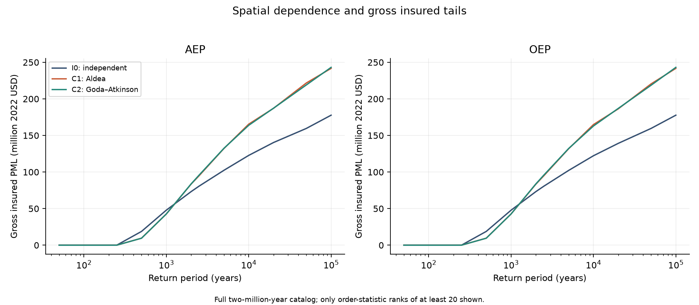
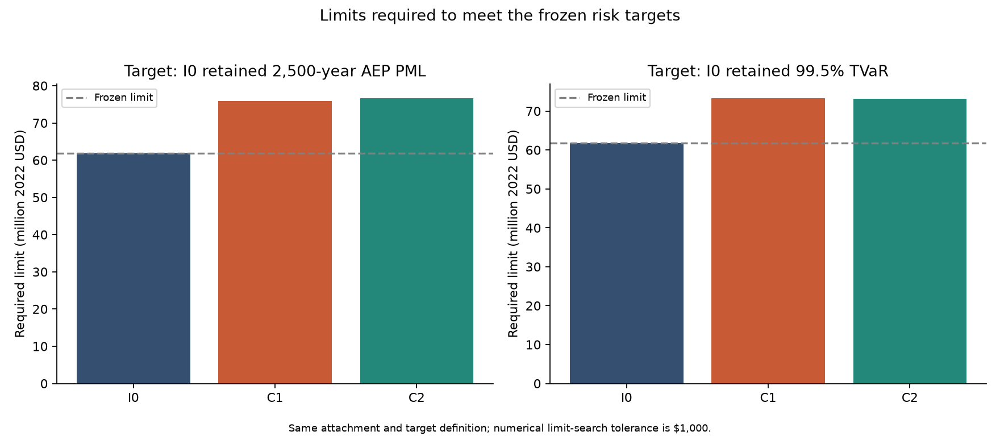
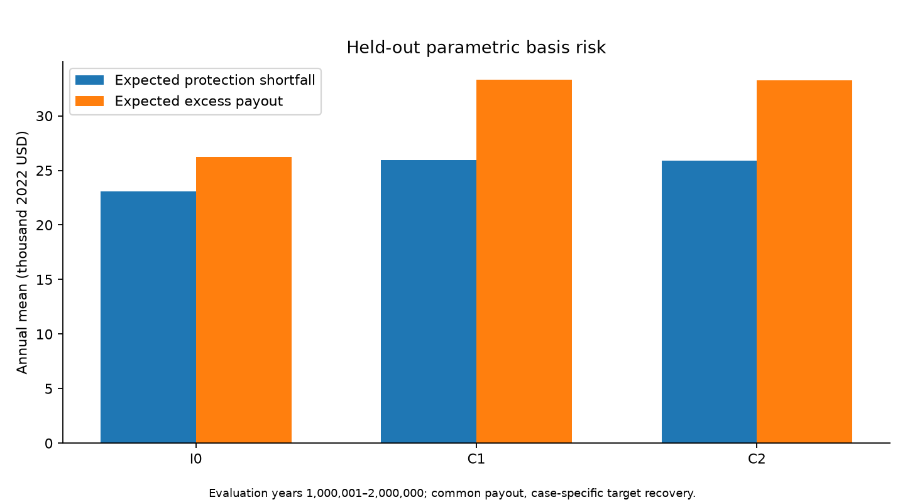

# Project Case Study: Seismic Correlation and Insurance Loss

## From USGS seismic sources to correlated portfolio loss and risk transfer

This project is a reproducible, 13-notebook earthquake catastrophe-risk workflow for a 470-building demonstration portfolio in Seaside, Oregon. It connects official U.S. Geological Survey seismic-source information to rupture occurrence rates, a long annual event catalog, site-level ground motions, structural and nonstructural damage, ground-up repair loss, insurance, reinsurance, capital metrics, and parametric catastrophe-bond basis risk.

Phase 1 establishes a controlled baseline with conditionally independent within-event residuals between sites. Phase 2 compares that baseline with two spatial-correlation models while preserving the same event catalog, exposure, financial terms, marginal ground-motion distributions, and paired random-number streams.

The complete workflow is published as [release `v2.0.0`](https://github.com/NatCatAnalystRandle/seismic-correlation-insurance-loss/releases/tag/v2.0.0).

## Project at a glance

| Item | Validated value |
|---|---:|
| Portfolio location | Seaside, Oregon |
| Buildings | 470 |
| Replacement value | $384.24 million, constant 2022 USD |
| Catalog duration | 2,000,000 years |
| Simulated earthquake occurrences | 10,630 |
| Occupied catalog years | 10,593 |
| Dependence cases | 3 |
| Modeling notebooks | 13 |
| Automated tests | 92 passing |
| Final critical validation failures | 0 |

## Why I built it

Engineering analyses often stop at hazard or physical damage, while insurance analyses often begin with financial loss tables. I wanted to build and audit the chain between the two.

The project asks:

1. Which Cascadia interface and Oregon intraslab ruptures affect the portfolio?
2. How often does each rupture occur?
3. Which events occur in each simulated year, including zero-event and multiple-event years?
4. How do PGA and SA(0.4 s) vary across the portfolio?
5. How does spatial dependence change structural and nonstructural damage?
6. How does damage convert into ground-up and insured repair loss?
7. How do occurrence and aggregate reinsurance programs reshape retained tail risk?
8. How much additional limit is required when spatial correlation changes the loss distribution?
9. How does a common parametric trigger perform out of sample against different dependence cases?

## End-to-end workflow

| Stage | Model output |
|---:|---|
| 1 | USGS NSHM seismic-source information |
| 2 | Annual stochastic event catalog |
| 3 | Paired ground-motion fields for all dependence cases |
| 4 | Structural and nonstructural building damage |
| 5 | Ground-up and insured portfolio loss |
| 6 | Reinsurance recovery and retained tail capital |
| 7 | Parametric catastrophe-bond payout and basis risk |
| 8 | Validated Phase 2 synthesis and figures |

## Technical approach

### Hazard and annual event catalog

The project uses the official USGS 2018 Conterminous United States National Seismic Hazard Model, `nshm-conus` release `5.2.4`. Rupture-level annual occurrence rates are expanded using the official `nshmp-haz 2.6.5` software stack with JDK 11 and its pinned Gradle wrapper.

Logic-tree weights, source-scale factors, rupture families, and magnitude-frequency definitions remain separate so that epistemic alternatives are not incorrectly combined as additive physical sources.

The 2,000,000-year catalog contains:

- 10,630 earthquake occurrences;
- 6,680 interface occurrences;
- 3,950 slab occurrences;
- 10,593 occupied years;
- 1,989,407 zero-event years;
- 36 multiple-event years.

Zero-event years are retained explicitly because annual loss distributions, AAL, AEP, VaR, and TVaR must be calculated over the declared catalog duration.

### Ground motion and paired dependence cases

The model simulates PGA and SA(0.4 s) for all 470 buildings. Every occurrence has a shared between-event residual across the portfolio, and PGA and SA(0.4 s) residuals are correlated at the same site.

Phase 2 compares three cases:

| Case | Role | Within-event spatial dependence |
|---|---|---|
| `I0_PHASE1_INDEPENDENT` | Frozen control | Independent between distinct sites |
| `C1_ALDEA22_SUBDUCTION` | Primary correlated case | Aldea, Heresi, and Pastén (2022) |
| `C2_GODA_ATKINSON09` | Sensitivity case | Goda and Atkinson (2009) |

The same catalog, between-event residuals, marginal within-event distributions, damage uniforms, exposure, and policy terms are used across the three cases. This paired design isolates the dependence assumption from unrelated simulation variation.

The two spatial-correlation models are analog models rather than Cascadia-specific calibrations. Their results are therefore model-conditioned estimates.

### Damage and policy loss

HAZUS-style fragility relationships sample:

- structural damage;
- nonstructural drift-sensitive damage;
- nonstructural acceleration-sensitive damage.

Damage states are converted into component repair-cost ratios and building-level ground-up losses. The demonstration insurance policy uses:

- 100% take-up;
- 100% covered repair-cost share;
- a 10% building replacement-value deductible per occurrence;
- a 100% replacement-value policy limit;
- 100% coinsurance.

The model reconciles structural and nonstructural components to ground-up loss, ground-up loss to insured plus uninsured loss, and gross insured loss to ceded plus retained loss.

### Reinsurance and capital

The frozen occurrence excess-of-loss program attaches at $18.81 million and has a $61.84 million occurrence limit with 100% participation.

Notebook 11 applies the same terms to all dependence cases and evaluates:

- the frozen occurrence program;
- alternative occurrence attachment and limit designs;
- standalone annual aggregate protection;
- annual aggregate protection stacked after the occurrence layer;
- retained and ceded AAL, AEP, OEP, PML, VaR, and TVaR;
- required occurrence limits;
- diversification diagnostics;
- break-even premium and RAROC assumption grids.

RAROC values use transparent illustrative assumptions. They are not market price estimates.

### Parametric catastrophe-bond basis risk

Notebook 12 calibrates a source-based magnitude-distance trigger using catalog years 1 through 1,000,000. The trigger is frozen before evaluation on years 1,000,001 through 2,000,000.

The same collateralized payout vector is applied to all three dependence cases. Evaluation records protection shortfall, excess payout, false positives, false negatives, collateral depletion, cash net loss, unfunded loss, surplus, and residual tail metrics.

This train/evaluation split prevents the evaluation losses from selecting or refitting the trigger.

## Key findings

### 1. Spatial correlation changes retained tail risk more clearly than expected loss

The small gross insured AAL differences have paired bootstrap intervals that include zero. The results do not establish a resolved AAL effect.

Under the common frozen occurrence program:

| Case | Gross insured AAL | Ceded AAL | Retained 2,500-year AEP PML |
|---|---:|---:|---:|
| I0: independent | $122,979.56 | $63,676.60 | $19.36 million |
| C1: Aldea | $123,443.43 | $58,654.69 | $33.27 million |
| C2: Goda and Atkinson | $123,335.68 | $58,604.14 | $34.08 million |

The stored paired bootstrap intervals for the retained 2,500-year PML differences exclude zero.

### 2. Fixed reinsurance terms do not provide equivalent tail protection

Using the same $18.81 million attachment, the modeled occurrence limit required to restore the independent case's retained 2,500-year PML is:

| Case | Required occurrence limit |
|---|---:|
| I0: independent | $61.84 million |
| C1: Aldea | $75.90 million |
| C2: Goda and Atkinson | $76.67 million |

The estimates use a $1,000 numerical search tolerance. They are conditional model results rather than placement recommendations.

### 3. The parametric trigger has visible basis risk

During the held-out evaluation period, the common collateralized payout AAL is $67,001.45. The corresponding target indemnity-recovery AALs are $63,881.84 for I0, $59,634.33 for C1, and $59,660.69 for C2.

Expected protection shortfall is approximately $23,099 for I0 and $25,900 for the two correlated cases. Expected excess payout is approximately $26,218 for I0 and $33,300 for the correlated cases.

These results show why an average payout close to an average indemnity recovery does not eliminate event-level basis risk.

## Validation and reproducibility

The workflow is deterministic, restartable, and designed for audit. It includes:

- frozen configuration and model-specification records;
- common event catalogs and paired random streams;
- chunked processing and restart markers;
- row-count, uniqueness, schema, and numerical-bound checks;
- building, event, and annual accounting reconciliation;
- SHA-256 hashes and artifact inventories;
- explicit zero-event years;
- paired bootstrap uncertainty;
- repository-level tests and validation.

The final Phase 2 synthesis passed:

- 92 automated tests;
- 65 upstream artifact checks with no skipped checks;
- 14 final synthesis checks;
- zero critical failures.

The [final Phase 2 results report](../data/metadata/phase_2/notebook_13_phase_2_results/notebook_13_results_report.md) and [production handoff](../data/metadata/phase_2/notebook_13_phase_2_results/notebook_13_final_handoff.json) provide the numerical results and audit trail.

## Scope and limitations

This is a transparent research and portfolio demonstration, not a production catastrophe model, insurance quotation, or regulatory capital estimate.

The results are conditional on:

- one synthetic W2 portfolio in Seaside, Oregon;
- the selected USGS release and ground-motion implementation;
- HAZUS-style fragility and repair-cost approximations;
- synthetic insurance, reinsurance, and parametric terms;
- building repair loss only;
- no contents, business interruption, demand surge, claims inflation, or reinstatement pricing;
- limited empirical support at the most extreme return periods.

Sparse annual losses make selected VaR measures non-informative, so supported PML and TVaR measures carry the substantive tail interpretation. The paired bootstrap is conditional on the implemented model and, for Notebook 12, on the frozen trigger.

## Repository map

| Notebook | Purpose |
|---|---|
| `01_download_and_inspect_usgs_nshm2018.ipynb` | Download, verify, inventory, and inspect the USGS model |
| `02_extract_usgs_rupture_rates.ipynb` | Expand source definitions into rupture-level annual rates |
| `03_generate_annual_event_catalog.ipynb` | Generate the 2-million-year annual event catalog |
| `04_generate_ground_motion_fields.ipynb` | Calculate distances and simulate baseline ground motions |
| `05_calculate_ground_up_losses.ipynb` | Model damage and calculate ground-up loss |
| `06_apply_insurance_terms.ipynb` | Apply policy and baseline reinsurance terms |
| `07_baseline_results_and_validation.ipynb` | Validate and report the Phase 1 baseline |
| `08_spatial_correlation_model_and_validation.ipynb` | Define and validate the three dependence cases |
| `09_generate_correlated_ground_motion_fields.ipynb` | Generate paired full-catalog ground-motion fields |
| `10_correlated_damage_and_loss.ipynb` | Propagate paired fields through damage and policy loss |
| `11_reinsurance_sensitivity_and_capital.ipynb` | Evaluate reinsurance structures, capital, and required limits |
| `12_parametric_cat_bond_basis_risk.ipynb` | Calibrate and evaluate the parametric trigger |
| `13_phase_2_results_and_validation.ipynb` | Audit artifacts and synthesize final results |

**Repository:** [NatCatAnalystRandle/seismic-correlation-insurance-loss](https://github.com/NatCatAnalystRandle/seismic-correlation-insurance-loss)

**Release:** [Phase 2: Correlated Earthquake Loss and Risk Transfer](https://github.com/NatCatAnalystRandle/seismic-correlation-insurance-loss/releases/tag/v2.0.0)
