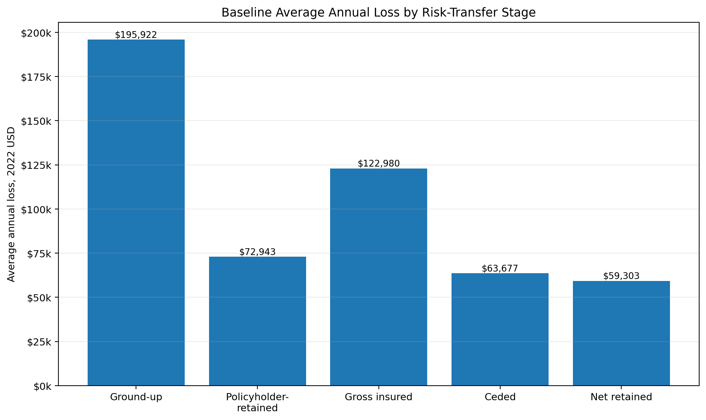
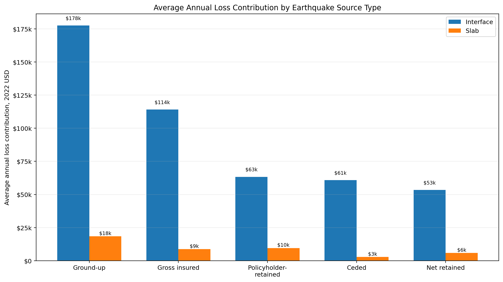
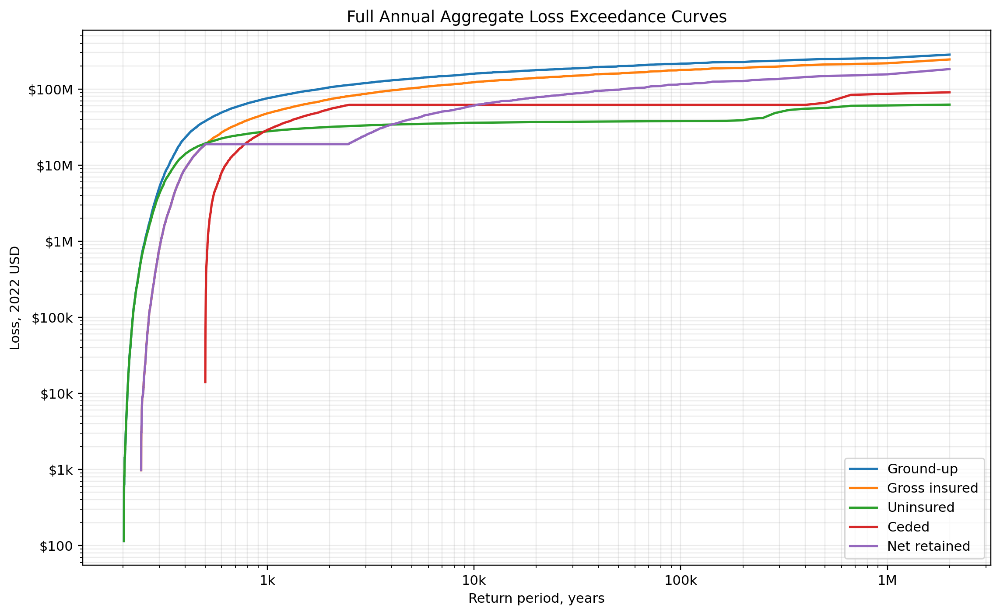
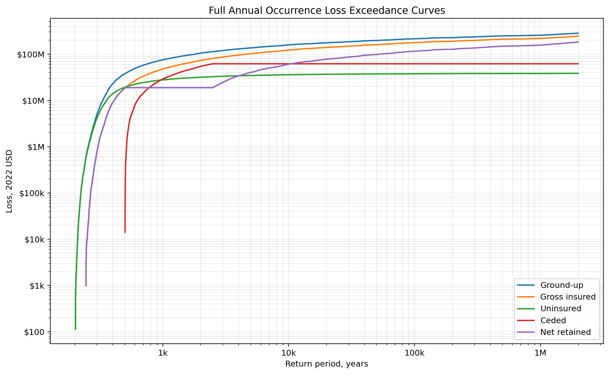

# Project Case Study: Seismic Catastrophe Risk Modeling for an Oregon Building Portfolio

## From USGS NSHM 2018 ruptures to insurance and reinsurance loss metrics

This project builds an end-to-end earthquake catastrophe-risk workflow for a 470-building demonstration portfolio in Seaside, Oregon. It connects official U.S. Geological Survey seismic-source information to rupture occurrence rates, a long annual stochastic event catalog, site-level ground motions, structural and nonstructural damage, ground-up repair loss, insured loss, reinsurance recovery, and standard portfolio risk metrics.

Phase 1 is the controlled baseline without spatial correlation among within-event site residuals. Phase 2 will reuse the same event catalog, exposure, financial terms, and random-stream structure to isolate the effect of spatial dependence on portfolio and reinsurance tail risk.

## Project at a glance

| Item | Phase 1 value |
|---|---:|
| Portfolio location | Seaside, Oregon |
| Buildings | 470 |
| Replacement value | $384.24 million, 2022 USD |
| Catalog duration | 2,000,000 years |
| Simulated earthquake occurrences | 10,630 |
| Ground-up AAL | $195,922 |
| Gross insured AAL | $122,980 |
| Ceded AAL | $63,677 |
| Net retained AAL | $59,303 |

## Why I built it

Many engineering projects stop at hazard or physical damage, while insurance projects often begin with financial loss tables. I wanted to build the full chain between the two.

The project answers the following questions:

1. Which Cascadia interface and Oregon intraslab ruptures can affect the portfolio?
2. How often does each rupture occur?
3. Which events occur in each simulated year, including zero-event and multiple-event years?
4. What PGA and SA(0.4) values occur at each building site?
5. What structural and nonstructural damage states result?
6. How does damage convert into repair cost?
7. How much loss is insured, uninsured, ceded, and retained?
8. What do the AAL, AEP, OEP, and PML distributions look like?

## End-to-end workflow

```mermaid
flowchart LR
    A[USGS NSHM 2018 sources] --> B[Rupture-level annual rates]
    B --> C[Two-million-year annual event catalog]
    C --> D[Rupture-to-site distances]
    D --> E[PGA and SA 0.4 ground-motion fields]
    E --> F[Structural and nonstructural damage]
    F --> G[Ground-up repair loss]
    G --> H[Gross insured and uninsured loss]
    H --> I[Occurrence XoL ceded and retained loss]
    I --> J[AAL, AEP, OEP, and PML]
```

The implementation is organized into seven restartable notebooks. Each notebook validates the accepted handoff from the previous stage before performing its own calculations.

## Technical approach

### Hazard and rupture rates

The project uses the official USGS 2018 Conterminous United States National Seismic Hazard Model, `nshm-conus` release `5.2.4`. Rupture-level annual occurrence rates are expanded using the official `nshmp-haz 2.6.5` software stack with JDK 11 and the pinned Gradle wrapper.

Logic-tree weights, source-scale factors, rupture families, and magnitude-frequency definitions are kept separate so that epistemic alternatives are not incorrectly combined as additive physical sources.

### Annual event catalog

A two-million-year catalog is generated from rupture-level annual rates. It contains:

- 10,630 total occurrences
- 6,680 interface occurrences
- 3,950 slab occurrences
- 10,593 occupied years
- 1,989,407 zero-event years
- 36 multiple-event years

Retaining zero-event years is essential for unbiased annual risk metrics.

### Ground motion and dependence

The baseline simulates PGA and SA(0.4) using a source-appropriate subduction ground-motion model. Each occurrence has a shared between-event residual across the portfolio. Within-event residuals are conditionally independent across sites in Phase 1, while PGA and SA(0.4) residuals are correlated at the same site.

This creates a clean reference case for the future spatial-correlation comparison.

### Damage and ground-up loss

HAZUS-style fragility relationships are used to sample structural, nonstructural drift-sensitive, and nonstructural acceleration-sensitive damage states. Damage states are converted into component repair-cost ratios and building-level repair losses.

### Insurance and reinsurance

The demonstration policy uses:

- 100% take-up
- 100% covered repair share
- 10% building replacement-value deductible
- 100% replacement-value limit
- 100% coinsurance

The occurrence excess-of-loss layer attaches at approximately $18.81 million and has a limit of approximately $61.84 million, with no annual aggregate cap or reinstatement restriction.

## Key results

The baseline loss flow is:

| Loss view | AAL | Share |
|---|---:|---:|
| Ground-up | $195,922 | 100.00% of ground-up |
| Gross insured | $122,980 | 62.77% of ground-up |
| Uninsured | $72,943 | 37.23% of ground-up |
| Ceded | $63,677 | 51.78% of gross insured |
| Net retained | $59,303 | 48.22% of gross insured |

The accounting identities reconcile:

$$
\text{Ground-up AAL} = \text{Gross insured AAL} + \text{Uninsured AAL}
$$

$$
\text{Gross insured AAL} = \text{Ceded AAL} + \text{Net retained AAL}
$$

### Damage components

- Structural damage: 8.74% of ground-up AAL
- Nonstructural drift-sensitive damage: 15.01%
- Nonstructural acceleration-sensitive damage: 76.25%

The result shows that expected repair loss can be dominated by nonstructural damage even when structural damage receives more attention in engineering discussions.

### Source contributions

Cascadia interface earthquakes contribute approximately:

- 90.60% of ground-up AAL
- 95.49% of ceded AAL

The ceded portfolio is therefore more concentrated in the interface source than the underlying ground-up portfolio.

### Tail risk

The largest modeled occurrence is a magnitude 9.34 Cascadia interface event with:

- $282.75 million ground-up loss
- $244.33 million gross insured loss
- $61.84 million ceded loss, equal to the occurrence layer limit

The largest annual aggregate ceded loss is $90.41 million. It exceeds the single-occurrence layer limit because separate events can each generate recovery when there is no annual aggregate cap.

## Validation and reproducibility

Validation is embedded throughout the workflow. The project includes:

- archive and artifact SHA-256 checks
- rupture-rate reconciliation
- unique rupture and occurrence keys
- annual-rate and catalog checks
- complete occurrence-site grid checks
- distance and ground-motion diagnostics
- damage-probability and repair-ratio bounds
- sampled-versus-analytical loss comparisons
- insurance and reinsurance accounting reconciliations
- chunk manifests and restart markers
- deterministic random-number namespaces
- portable repository paths
- a repository validation script

The final reporting notebook completed 87 critical checks with no failures or unresolved warnings. The separate repository-hardening validator completed 54 checks with zero critical failures.

## Why this matters for catastrophe risk and reinsurance

This project demonstrates how engineering assumptions propagate into insurance outcomes. It shows how:

- deductibles change expected insured loss
- occurrence reinsurance reshapes the retained tail
- source concentration changes between ground-up and ceded views
- AEP and OEP answer different annual and occurrence questions
- dependence assumptions can affect portfolio concentration and layer performance

The workflow is designed to support roles in catastrophe modeling, natural-hazard analytics, insurance, reinsurance, risk engineering, and insurance-linked securities.

## Scope and limitations

This is a transparent portfolio demonstration, not a production catastrophe model, insurance price quote, or regulatory capital estimate. Important limitations include:

- one Seaside demonstration portfolio
- W2 building focus
- repair-cost loss only
- synthetic policy and reinsurance terms
- no demand surge or post-event inflation
- no business interruption, contents, or casualty loss
- no spatial correlation among within-event site residuals in Phase 1

## Phase 2

Phase 2 will add source-appropriate spatial correlation while preserving the same:

- buildings and site order
- rupture set and annual event catalog
- marginal ground-motion distributions
- policy and reinsurance terms
- damage uniforms and random-stream structure where practical

This paired design will isolate the effect of spatial dependence on ground-up, insured, retained, and ceded loss.

## Repository map

| Notebook | Purpose |
|---|---|
| `01_download_and_inspect_usgs_nshm2018.ipynb` | Download, verify, inventory, and inspect the USGS model |
| `02_extract_usgs_rupture_rates.ipynb` | Expand source definitions into rupture-level annual rates |
| `03_generate_annual_event_catalog.ipynb` | Generate the two-million-year annual event catalog |
| `04_generate_ground_motion_fields.ipynb` | Calculate distances and simulate ground-motion fields |
| `05_calculate_ground_up_losses.ipynb` | Model damage and calculate ground-up loss |
| `06_apply_insurance_terms.ipynb` | Apply policy and reinsurance terms |
| `07_baseline_results_and_validation.ipynb` | Produce final results, figures, and validation |

**Repository:** [NatCatAnalystRandle/seismic-correlation-insurance-loss](https://github.com/NatCatAnalystRandle/seismic-correlation-insurance-loss)
